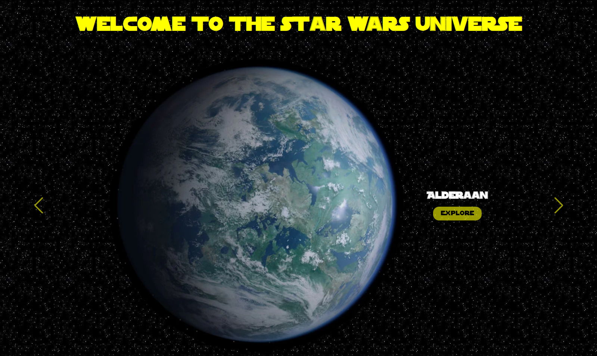
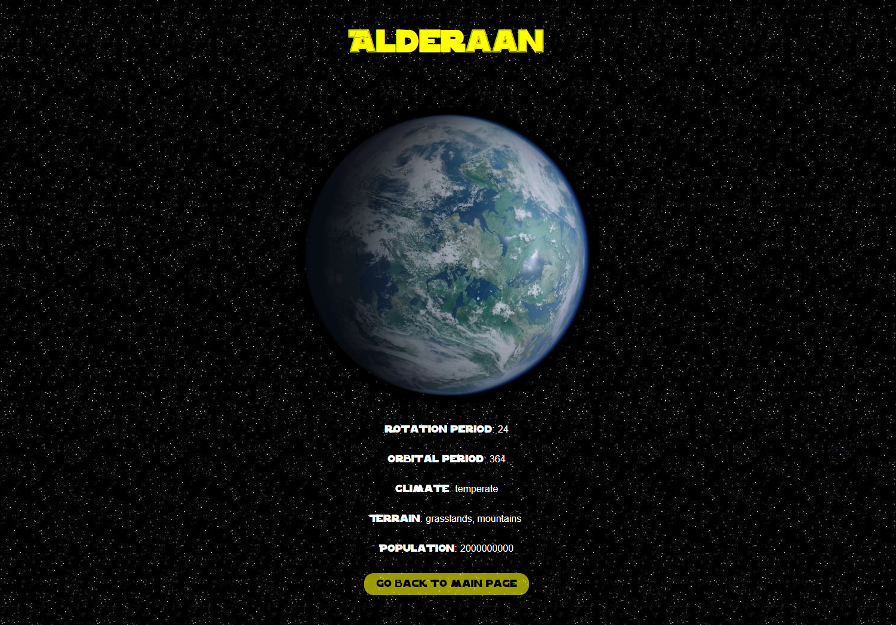

# Star Wars API

An API exercise done during my training at [BeCode](https://becode.org/all-trainings/pedagogical-framework-junior-developer/).

## The Goal

The instruction were simple "*Have fun with [this](https://swapi.dev/documentation) Star Wars API and surprise us!*"  
So I used the Star Wars API to display some informations about some very carefully selected planets from the Star Wars universe and had some fun adding some soundscape to all planets.

## What does it look like ?

Check the result ➡️ [here](https://dystrima.github.io/Star-Wars-API/) ⬅️

